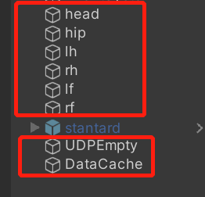
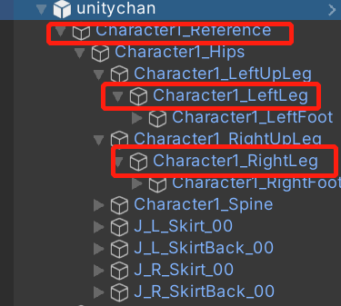
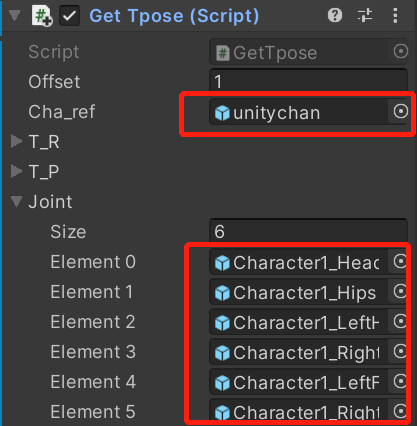
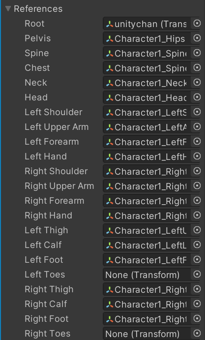
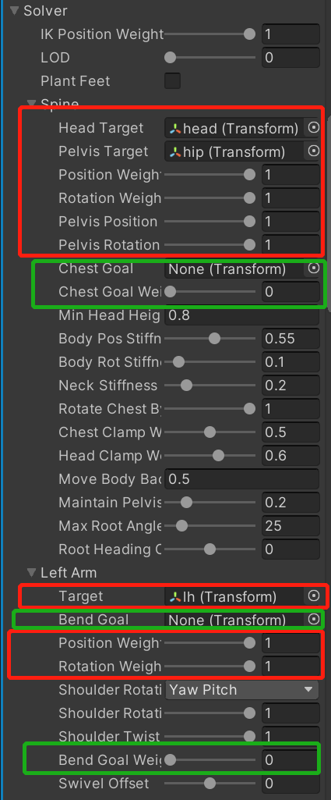

# MocapUnityIK
旧工程存档，原始工程最后修改时间为2022.4。

该工程基于IK（反向运动学）实现少量跟踪器数据驱动虚拟角色运动。其中，将Bvh格式文件中提取的部分关节位姿数据作为跟踪器模拟数据，跟踪器模拟数据读取过程由SendBvh文件夹中的程序实现。Unity工程在IKUnity文件夹，驱动虚拟角色运动过程在Unity中完成。

##运行环境
* Unity2019.4
  安装Final IK 1.9插件
* Python 3.6.4
  安装opencv，vtk

##使用说明
该工程支持离线读取txt数据和实时发送数据两种方式。数据发送端与接收端分别按以下流程操作

###数据发送
数据发送相关程序在SendBvh文件夹中，运行testBVH_new.py即可。

若需离线读取txt数据，运行函数
```python
#输入参数分别为原始bvh文件路径，从bvh文件中读取数据的保存路径
SaveUnity("Take Dance 1 Multi.bvh","SendUnity6Tracker.txt")
```
保存的txt文件需要复制到Unity工程的Assets文件夹中。

若需实时发送数据，运行函数
```python
#输入参数分别为IP地址与端口号
UDPsend("127.0.0.1",4321)
```
###数据接收
运行Unity场景，场景中需新建空物体(head~rf)用于接收跟踪器数据。若接收实时发送的数据，还需新建空物体UDPEmpty和DataCache，DataCache上挂载脚本RecDataCache.cs，UDPEmpty上挂载Loom.cs和UdpServer.cs并指定Datacache变量。



虚拟角色放置在场景中，虚拟角色必须为Humanoid人形动画模式，骨架参考系(Reference)归零，膝盖(Leg)赋一定的弯曲角度作为IK解算的参考。



虚拟角色上挂载GetTpose.cs，获取虚拟角色T-pose时的位姿，并指定角色和跟踪器对应骨骼。



虚拟角色上挂载VRIK.cs，用于解算角色全身位姿。

设置解算骨骼，注意不能设置脚趾。



设置解算器，注意只有当权重大于0时相应Target才会起作用。该工程只使用关节链的末端子节点解算，VRIK中还可以添加胸部，肘部等作为Target。



若读取离线txt数据，角色上还需挂载脚本SetPose.cs，若接收实时数据则挂载SetPoseUDP.cs。运行场景后需在10s内按键盘A键标定真实数据与虚拟角色数据。
